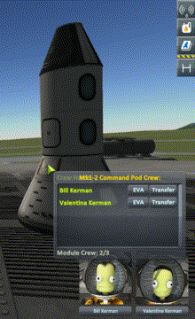
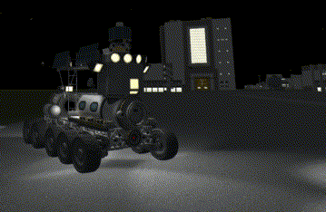
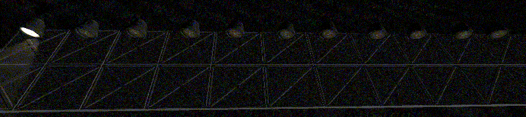
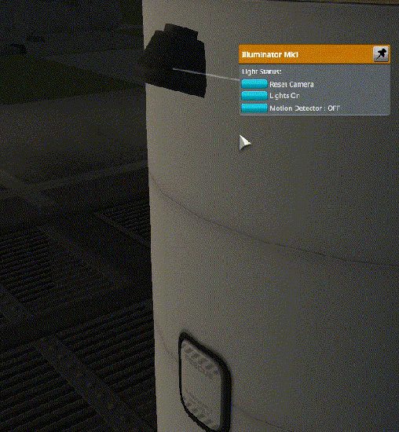
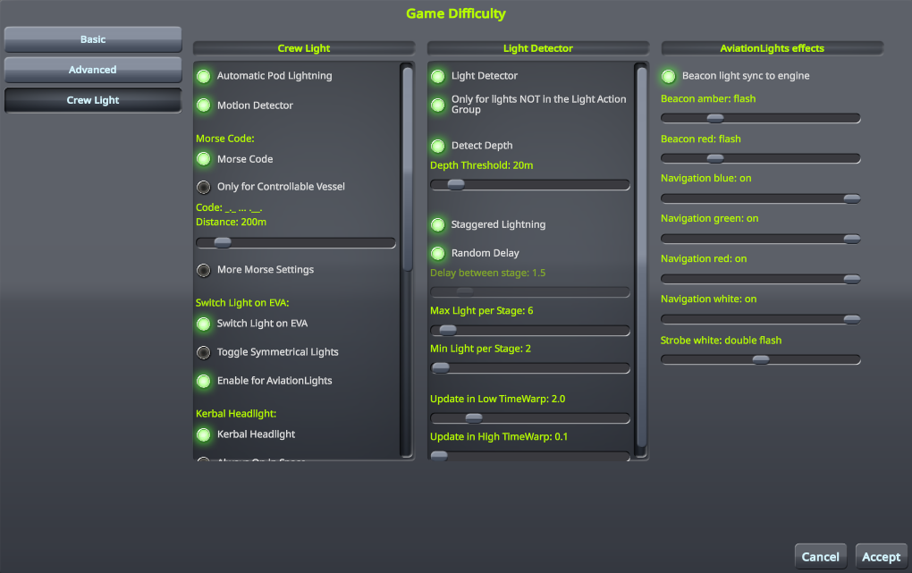
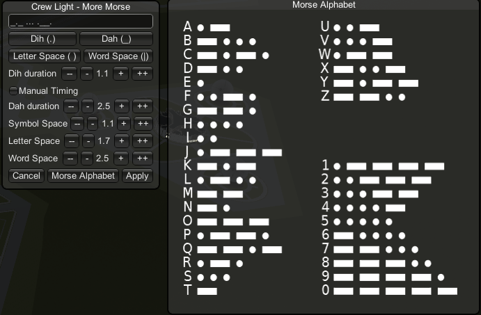
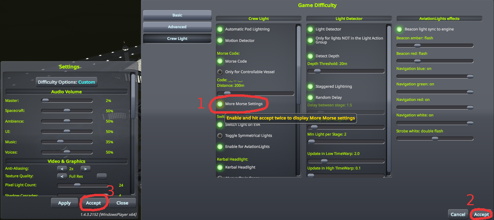

# CrewLight /L Unleashed

**CrewLight** is an automatic light manager.

[Unleashed](https://ksp.lisias.net/add-ons-unleashed/) fork by Lisias.

## In a Hurry

* [Latest Release](https://github.com/net-lisias-kspu/CrewLight/releases)
    + [Binaries](https://github.com/net-lisias-kspu/CrewLight/tree/Archive)
* [Source](https://github.com/net-lisias-kspu/CrewLight)
* Documentation
    + [Project's README](https://github.com/net-lisias-kspu/CrewLight/blob/master/README.md)
    + [Install Instructions](https://github.com/net-lisias-kspu/CrewLight/blob/master/INSTALL.md)
    + [Change Log](./CHANGE_LOG.md)
    + [TODO](./TODO.md) list

## Description

### What does it do ?

It automatize lights managment !

#### Every part that currently hold crew gets its lights turning on

#### Lights react to the sunshine

#### And to the depth

GIF incoming...

#### When approaching a distant vessel its lights will blink, sending you a welcoming message in Morse code

#### Kerbal on EVA can toggle lights

#### Lights can have a motion detector set up

### [Youtube review by KottabosGames](https://youtu.be/AE1pvzh2q1Y)

### How does it works ?

Vessel's lights are divided into 3 groups : 
* **Lights of crew-able part :**
  * They will remain off until a kerbal gets on-board
* **Lights NOT in the light action group : _(and kerbal's helmet light)_**
  * They'll go on when the sun's fall, off when it rises
* **Other Lights :**
  * They will work as usual, toggling by the light action group
  
This mod rely on the light action group to determine which light belongs to which group, in stock KSP you can change action group only in the editor, so no lights on all crafts already launched will react to the sun rising/falling. To change action group in flight you will need the mod [Action Groups Extended](http://forum.kerbalspaceprogram.com/index.php?/topic/67235-122dec1016-action-groups-extended-250-action-groups-in-flight-editing-now-kosremotetech/), by Diazo.
  
  
### How to modify how it works ?
  
Most of the function can be disabled, or tweaked, directly from the in-game settings screen : 
 

 
There's also some extra option for the Morse Code message. 
 

 
Due to limitation of the stock settings menu (or limitation to my modding skill :p ) it's a bit tricky to access it : in the settings screen enable the "More Morse Settings", hit accept, twice, and you got it.
 

Here you can change the morse message send by distant vessel as you approch them. And the timing for the different symbol (they are sync to the dit duration unless you check manual timing).
 
  
  
### What is needed ?
  
[ModuleManager](http://forum.kerbalspaceprogram.com/index.php?/topic/50533-121-module-manager-275-november-29th-2016-better-late-than-never/) is the only dependency, all credits go to ialdabaoth and sarbian

### Know issues :

Lights on kerbal's helmet don't turn on/off as the sun rises/falls. Lights will be turned on if the kerbal disembark in the dark but status of the sunlight won't be checked after that.
The range sphere of the Motion Detector is offset from the light position only for the stock light, for others the sphere center is at the light position.

### What to do if it doesn't work ?

Report it to [Github](https://github.com/Li0n-0/CrewLight).

**A big thanks to all the modders/users of the KSP forum who have helped me, directly and by answering question before I posted them** :wink:

## Installation

Detailed installation instructions are now on its own file (see the [In a Hurry](#in-a-hurry) section) and on the distribution file.

### Licensing

* Crew Light is double licensed as follows:
	+ [SKL 1.0](https://ksp.lisias.net/SKL-1_0.txt). See [here](./LICENSE.KSPe.SKL-1_0)
		+ You are free to:
			- Use : unpack and use the material in any computer or device
			- Redistribute : redistribute the original package in any medium
		+ Under the following terms:
			- You agree to use the material only on (or to) KSP
			- You don't alter the package in any form or way (but you can embedded it)
			- You don't change the material in any way, and retain any copyright notices
			- You must explicitly state the author's Copyright, as well an Official Site for downloading the original and new versions (the one you used to download is good enough)
	+ [GPL 2.0](https://www.gnu.org/licenses/gpl-2.0.txt). See [here](./LICENSE.KSPe.GPL-2_0)
		+ You are free to:
			- Use : unpack and use the material in any computer or device
			- Redistribute : redistribute the original package in any medium
			- Adapt : Reuse, modify or incorporate source code into your works (and redistribute it!) 
		+ Under the following terms:
			- You retain any copyright notices
			- You recognise and respect any trademarks
			- You don't impersonate the authors, neither redistribute a derivative that could be misrepresented as theirs.
			- You credit the author and republish the copyright notices on your works where the code is used.
			- You relicense (and fully comply) your works using GPL 2.0
			- You don't mix your work with GPL incompatible works.
	* If by some reason the GPL would be invalid for you, rest assured that you still retain the right to Use the Work under SKL 1.0. 

Releases previous to 1.20 are still available under the MIT license [here](https://github.com/net-lisias-kspu/CrewLight/tree/upstream/master).

Please note the copyrights and trademarks in [NOTICE](./NOTICE).

## Upstream

* [Li0n](https://forum.kerbalspaceprogram.com/index.php?/profile/142527-li0n/): ROOT / Dropped Support
	+ [Forum](https://forum.kerbalspaceprogram.com/index.php?/topic/154901-*)
	+ [SpaceDock](https://spacedock.info/mod/1012/Crew%20Light)
	+ [GitHub](https://github.com/Li0n-0/CrewLight.git)

